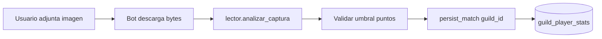

# Flujo OCR → MMR

- Parámetros OCR vienen de `guild_config` (márgenes, confianza, color).
- Sin imagen válida no hay MMR.
- Cada partida asocia `guild_id` en `partidas` y actualiza MMR solo en ese servidor.
